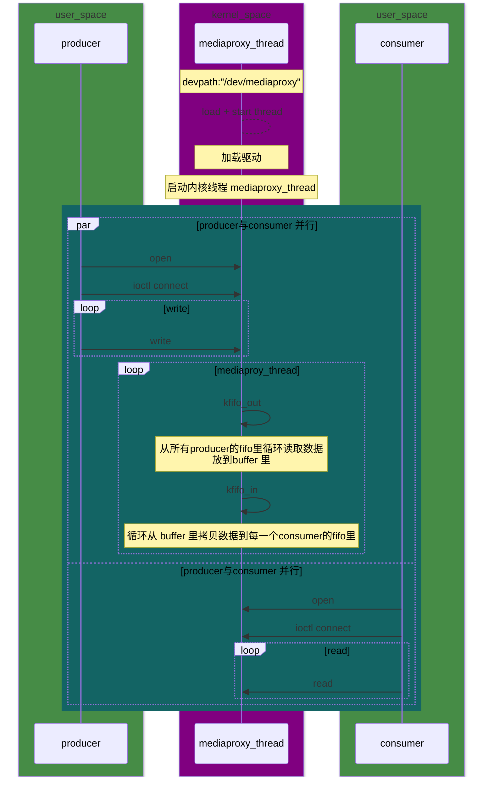

# mediaproxy driver

Media Proxy 驱动主要的功能就是做消息的中转站。使用KFIFO数据结构用来存放和转发消息数据。 目前支持 MPMC （多生产者多消费之模式）， 内部实现了一个名为 mediaproxy_thread 的内核线程， 负责将所有producer KFIFO 里的消息数据做整合&筛选， 并转发到每一个consumer 的KFIFO 中。

## 时序图



## mediaproxy 数据结构

### mediaproxy dev

```c
/*
* struct mediaproxy_dev - the metadata of the mediaproxy device node
* @major:                       the major device number of mediaproxy dev
* @has_consumer                 the consumer count
* @all_producer_fifo_empty      used to determine if there is data in the producer's fifo
* @producers:                   array for Storing Producer Sessions
* @consumers:                   array for Storing Consumers Sessions
* @p_lock                       mutex lock for producer
* @c_lock                       mutex lock for consumer
* @read_queue                   consumer wait queue for message
* @transfer_queue               wait queue fot transfer thread (mediaproxy_thread)
*/
struct mediaproxy_dev {
    int major;
    unsigned int has_consumer;
    bool all_producer_fifo_empty;
    mp_session* producers[MAX_SESSION];
    mp_session* consumers[MAX_SESSION];
    struct mutex p_lock;
    struct mutex c_lock;
    wait_queue_head_t read_queue;
    wait_queue_head_t transfer_queue;
};
```

### mediaproxy session

```c
/*
* struct mediaproxy_session - the session for connect
* @session_id       index of the mp_session array
* @role             producer or consumer
* @subscribe_msg_type          Type mask for subscription messages, currently available only to consumers
* @lock             a pointer to the p_lock/c_lock within the dev structure
* @session_entry    a pointer to the producers/consumers session array within the dev
* @msg_kfifo        the FIFO in the session is used to store message data
*/
typedef struct mediaproxy_session {
    int session_id;
    mp_role_e role;
    uint32_t subscribe_msg_type;
    struct mutex *lock;
    struct mediaproxy_session **session_entry;
    DECLARE_KFIFO_PTR(msg_kfifo, unsigned char);
} mp_session;
```

### mediaproxy 消息队列（KFIFO）

[KFIFO 头文件](http://opengrok.amlogic.com:8080/source/xref/androidS/vendor/amlogic/common/kernel/common/include/linux/kfifo.h)

**KFIFO：** （Kernel FIFO）是 Linux 内核中提供的一种线程安全的先进先出（FIFO）缓冲区数据结构。它被设计用于在内核中实现多线程或多进程之间的数据传输，特别是在设备驱动程序中处理输入和输出数据时非常有用。KFIFO提供了一种有效的方式来在内核中管理数据的流动。

**线程安全**：KFIFO 是线程安全的数据结构，可以安全地从多个线程或进程中读取和写入数据，而无需额外的锁或同步机制。

**环形缓冲区**：KFIFO 使用环形缓冲区来存储数据，这意味着一旦缓冲区满了，新的数据将从缓冲区的开头重新写入。这使得它非常适合用于循环或环形数据流。

**支持不定长度的数据**：KFIFO 可以存储不定长度的数据块，因此适用于处理各种大小的数据。

**支持阻塞和非阻塞操作**：KFIFO 支持阻塞和非阻塞的读写操作。这使得它适用于不同的应用场景，例如等待数据可用时执行阻塞读取，或者立即返回而不阻塞的非阻塞读取。

**内核空间使用**：KFIFO 主要设计用于内核空间，因此在内核模块和设备驱动程序中广泛使用。


## 对外接口

总体来说就是文件基本的操作函数，包括打开、关闭、读写、ioctl等。

```c
// 已实现的文件操作函数
struct file_operations mediaproxy_fops = {
    .owner = THIS_MODULE,
    .read = mediaproxy_read,
    .write = mediaproxy_write,
    .open = mediaproxy_open,
    .release = mediaproxy_release,
    .unlocked_ioctl = mediaproxy_ioctl,
#ifdef CONFIG_COMPAT
	.compat_ioctl = mediaproxy_ioctl,
#endif
};
```

### 函数返回值

#### 1. open

0 成功，小于0 失败

#### 2. close

0 成功，小于0 失败

#### 3. read

成功 返回读取的字节数，小于0 失败

errno：
-EFAULT mediaproxy未初始化或者 copy_to_user 失败

非阻塞模式下(O_NONBLOCK):
-EAGAIN 没有数据

阻塞模式下:
-ETIMEDOUT      等待 10s 超时
-ERESTARTSYS    被信号中断等待

| errno | 描述 |
| --- | --- |
| EFAULT | Mediaproxy 未初始化或者 copy_to_user 失败|
| EAGAIN | 没有数据（仅限非阻塞模式下(O_NONBLOCK)）|
| ETIMEDOUT | 等待 10s 超时（仅限阻塞模式下）|
| ERESTARTSYS | 被信号中断等待（仅限阻塞模式下）|

#### 4. write

成功返回 写入的字节数，小于0 失败

| errno | 描述 |
| --- | --- |
| EFAULT | Mediaproxy 未初始化或者 copy_from_user 失败|

#### 5. ioctl

```c
// ioctl cmd
#define MEDIAPROXY_MAGIC 'm'
#define MEDIAPROXY_CONNECT _IOW(MEDIAPROXY_MAGIC, 0, int)
#define MEDIAPROXY_DISCONNECT _IOW(MEDIAPROXY_MAGIC, 1, int)
#define MEDIAPROXY_MSG_TYPE__SUBSCRIBE _IOW(MEDIAPROXY_MAGIC, 3, int)

// ioctl args
typedef enum {
	MP_ROLE_INVALID,
	MP_ROLE_PRODUCER,
	MP_ROLE_CONSUMER,
} mp_role_e;

union mediaproxy_ioctl_args
{
    mp_role_e role;
    uint32_t subscribe_msg_type;
};
```

| cmd | 功能 | 返回值 |
| --- | --- | --- |
| MEDIAPROXY_CONNECT | 连接 | 成功 0， 失败 < 0 |
| MEDIAPROXY_DISCONNECT | 断开连接 | 成功 0， 失败 < 0 |

| errno | 描述 |
| --- | --- |
| EINVAL | 无效参数 |
| EFAULT | Mediaproxy 未初始化|
| EEXIST | Session 已经连接|
| ENOMEM | 存session的数组已满 |

```C++
typedef enum mp_role_e {
	MP_ROLE_INVALID,
	MP_ROLE_PRODUCER,
	MP_ROLE_CONSUMER,
} mp_role_e;

union mediaproxy_ioctl_args
{
    mp_role_e role;
};

void* producer_thread(void*) {
    union mediaproxy_ioctl_args args = {
        .role = MP_ROLE_PRODUCER,
    };
      if (ioctl(fd, MEDIAPROXY_CONNECT, &args) < 0) {
        perror("producer: Failed to connect");
        return NULL;
    }
    //  MEDIAPROXY_DISCONNECT 同理
    /*
        判断是否有 consumer 连接，如果没有（ret=0）， 就可以不写数据，以此来节省资源。
        由于不知道consumer connect和disconnect 的时间点， 所以MEDIAPROXY_GET_CONSUMER_COUNT ioctl 可能需要在每次写数据前调用
        注意： 这个ioctl 命令是选用的。
    */
    int ret = ioctl(fd,MEDIAPROXY_GET_CONSUMER_COUNT, NULL);
    if ( ret > 0) {
            ...
    } else if (ret == 0){
            ...
    } else {
            perror("producer: Failed to get consumer count");
        ...
    }
    }
```
